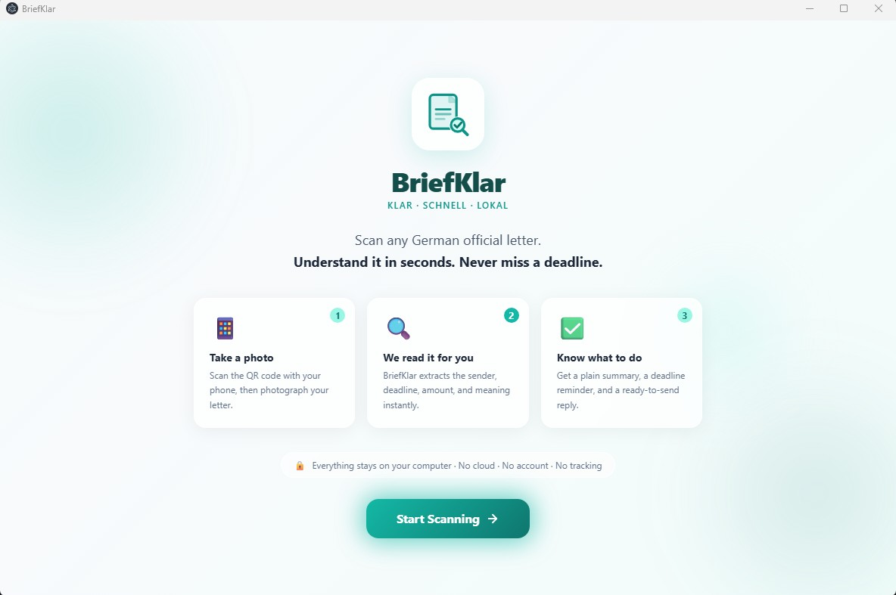

<div align="center">

<br />

# 📬 BriefKlar

### Scan any German letter. Know exactly what to do. Never miss a deadline.

<br />

[](https://github.com/MfFischer/briefklar/releases)
[](https://github.com/MfFischer/briefklar/releases)
[](https://www.electronjs.org/)
[](LICENSE)
[](https://github.com/MfFischer/briefklar)

<br />

> Germany sends letters for everything — taxes, courts, landlords, immigration.
> Each one has a deadline. Most consequences are permanent if you miss it.
> **BriefKlar tells you what the letter is, what to do, and how long you have.**

<br />



<br /><br />

</div>

---

## The Problem

Germany sends official letters that look like this:

> *"Gemäß § 355 Abs. 1 AO steht Ihnen gegen diesen Bescheid der Einspruch zu. Der Einspruch ist innerhalb eines Monats nach Bekanntgabe dieses Bescheids einzulegen."*

For millions of immigrants, expats, and international students — **this is unreadable.** And the consequences of ignoring it are severe:

| Letter | Ignored for | Result |
|---|---|---|
| Steuerbescheid | 1 month | You permanently lose the right to contest — even if the amount is wrong |
| Mahnbescheid | 14 days | Automatic enforcement order — bank accounts and wages can be seized |
| Kündigung (employer) | 21 days | You permanently lose the right to contest your dismissal |
| Ausländerbehörde | 4 weeks | Residence permit decisions become final |

**BriefKlar solves this.**

---

## How It Works

```
📱 Scan with phone  →  🔍 OCR + classify  →  ✅ Plain-language explanation
```

1. **Open BriefKlar** on your desktop — a QR code appears
2. **Scan the QR with your phone** — a camera viewfinder opens
3. **Photograph your letter** — align it to the A4 guide frame
4. **Get instant results** — letter type, deadline, what to do, free help resources

Everything runs **locally on your computer**. No cloud. No account. No subscription.

---

## Features

<table>
<tr>
<td width="50%">

**🔍 Smart Classification with OCR Tolerance**

Identifies 26 German letter types using weighted keyword scoring with **fuzzy matching** — handles OCR errors like "F1nanzamt" → Finanzamt, broken umlauts, and ligature splits. Confidence score shown so you always know how certain the result is.

</td>
<td width="50%">

**⏰ Deadline Detection (§ 122 AO)**

Extracts deadlines from letter text and applies the **§ 122 AO 3-Tages-Fiktion** — letters are legally deemed delivered 3 days after the postmark, not when you receive them.

</td>
</tr>
<tr>
<td width="50%">

**🌍 Multilingual Interface**

UI available in **English, German, Turkish, Arabic, and Ukrainian** — the five most common languages among people who need this app. Letter explanations are in plain English by default, with more languages coming.

</td>
<td width="50%">

**🆓 Free Help Resources**

Each letter type links to the relevant free German counselling services — Caritas MBE, Schuldnerberatung, Mieterverein, VdK, and more.

</td>
</tr>
<tr>
<td width="50%">

**📤 Share with Advisor**

One-tap copy of a clean, advisor-friendly summary. Paste it into an email to your Migrationsberater, print it for Schuldnerberatung, or export as a professional PDF.

</td>
<td width="50%">

**🔒 100% Offline**

No data ever leaves your computer. OCR runs locally with Tesseract.js. Database is a local SQLite file. AI reply generation is optional BYOK (bring your own key).

</td>
</tr>
<tr>
<td width="50%">

**📱 Mobile Scan via QR**

CamScanner-style viewfinder with A4 alignment frame. Phone and computer just need to be on the same WiFi.

</td>
<td width="50%">

**🔄 Misclassification Feedback**

"Was this wrong?" button on every letter. Your corrections are saved locally and help improve classification accuracy over time.

</td>
</tr>
</table>

---

## Architecture

### Why Desktop, Not Mobile?

BriefKlar is intentionally a desktop app. When people receive an official letter and need to respond — write a formal Einspruch, research their rights, compare with previous correspondence — they sit down at a computer. The desktop is where the real work happens. The phone's role is just the camera: scan the QR, snap a photo, done.

### Why Keyword Matching, Not an LLM?

1. **Instant.** Classification takes <100ms. No waiting for inference.
2. **Offline.** No model download, no background service, no dependencies.
3. **Deterministic.** Same letter always produces the same result.
4. **Lightweight.** The entire knowledge base is a 40KB JSON file.

The classifier uses **fuzzy matching with Levenshtein distance** to tolerate OCR errors — "F1nanzamt" matches "Finanzamt", broken umlauts are normalised, and ligature splits are handled. For letters that truly need AI (reply generation), BriefKlar supports optional **BYOK (Bring Your Own Key)** with Gemini's free tier — no bundled model, no mandatory install, no background process.

### Why BYOK Instead of a Bundled LLM?

The target audience (immigrants, non-technical users) should never have to install Ollama, download a 3–7 GB model, or debug why a background service isn't running. BYOK means:

- **Zero mandatory setup** — the app works fully without any API key
- **Free tier available** — Gemini's free tier handles 15 req/min, no credit card
- **No resource drain** — no local LLM hogging RAM/CPU during a quick scan
- **No dependency conflicts** — Ollama sets `ELECTRON_RUN_AS_NODE=1` globally, which breaks Electron apps

AI reply generation is a power-user feature, not a core requirement. The built-in legally-verified German reply templates (Einspruch, Widerspruch, Kündigung) work without any API key.

---

## Letter Types

<details>
<summary><strong>Tax (7 types)</strong></summary>

| Type | German | Urgency |
|---|---|---|
| Income Tax Assessment | Einkommensteuerbescheid | 🟠 High |
| VAT Assessment | Umsatzsteuerbescheid | 🟠 High |
| Property Tax | Grundsteuerbescheid | 🟡 Medium |
| Trade Tax | Gewerbesteuerbescheid | 🟠 High |
| Vehicle Tax | Kfz-Steuer | 🟢 Low |
| EU VAT ID Notice | USt-IdNr (BZSt) | 🟡 Medium |
| Personal Tax ID | Steueridentifikationsnummer | 🟢 Low |

</details>

<details>
<summary><strong>Debt & Enforcement (4 types)</strong></summary>

| Type | German | Urgency |
|---|---|---|
| Payment Reminder | Mahnung | 🔴 Critical |
| Debt Collection | Inkasso | 🟠 High |
| Court Payment Order | Mahnbescheid | 🔴 Critical |
| Bank/Wage Seizure | Pfändungs- und Überweisungsbeschluss | 🔴 Critical |

</details>

<details>
<summary><strong>Social Benefits (7 types)</strong></summary>

| Type | German | Urgency |
|---|---|---|
| Benefit Approval | Jobcenter – Bewilligungsbescheid | 🟢 Low |
| Benefit Cancellation | Jobcenter – Aufhebungsbescheid | 🔴 Critical |
| Benefit Sanction | Jobcenter – Sanktionsbescheid | 🔴 Critical |
| Health Insurance | Krankenkasse – Bescheid | 🟡 Medium |
| Parental Benefit | Elterngeld | 🟠 High |
| Housing Benefit | Wohngeld | 🟡 Medium |
| Child Benefit | Kindergeld – Familienkasse | 🟡 Medium |

</details>

<details>
<summary><strong>Immigration & Family (3 types)</strong></summary>

| Type | German | Urgency |
|---|---|---|
| Immigration Notice | Ausländerbehörde | 🔴 Critical |
| Naturalisation | Einbürgerungsbescheid | 🟠 High |
| Childcare Place | Kita / Kindergarten Bescheid | 🟠 High |

</details>

<details>
<summary><strong>Housing, Employment & Other (8 types)</strong></summary>

| Type | German | Urgency |
|---|---|---|
| Landlord Termination | Kündigung vom Vermieter | 🔴 Critical |
| Utility Bill Settlement | Nebenkostenabrechnung | 🟡 Medium |
| Employer Termination | Kündigung vom Arbeitgeber | 🔴 Critical |
| Court Notice | Gerichtsbescheid | 🔴 Critical |
| Pension Insurance | Deutsche Rentenversicherung | 🟡 Medium |
| Student Aid | BAföG | 🟠 High |
| Utility Provider | Strom / Gas / Internet | 🟢 Low |
| Broadcasting Fee | Rundfunkbeitrag (GEZ) | 🟢 Low |

</details>

---

## Tech Stack

| | Technology | Purpose |
|---|---|---|
| 🖥️ | [Electron 41](https://www.electronjs.org/) | Desktop shell |
| ⚡ | [electron-vite](https://electron-vite.org/) | Build tooling |
| ⚛️ | React 18 + TypeScript | Frontend |
| 🎨 | Tailwind CSS | Styling |
| 🔍 | [Tesseract.js](https://tesseract.projectnaptha.com/) | OCR (German `deu.traineddata`) |
| 🖼️ | [Sharp](https://sharp.pixelplumbing.com/) | Image preprocessing |
| 🗄️ | [better-sqlite3](https://github.com/WiseLibs/better-sqlite3) | Local database |
| 📦 | electron-builder + NSIS | Windows installer |
| 🌍 | Custom i18n | 5 languages: EN, DE, TR, AR, UK |

---

## Quick Start

### 1. Clone and install

```bash
git clone https://github.com/MfFischer/briefklar.git
cd briefklar
npm install
```

### 2. Get the German OCR model

BriefKlar needs `deu.traineddata` (~15 MB). Download it and place it at:

```
resources/tessdata/deu.traineddata
```

> Download: [github.com/tesseract-ocr/tessdata](https://github.com/tesseract-ocr/tessdata/raw/main/deu.traineddata)
>
> On first launch, BriefKlar automatically copies it to the right place.

### 3. Run

```bash
# Development
npm run dev

# Build Windows installer
npm run build:win
```

Installer output: `dist/BriefKlar Setup 0.2.0.exe`

---

## Project Structure

```
briefklar/
├── knowledge-base/
│   └── letters.json              # 26 letter type definitions
├── scripts/
│   ├── dev.js                    # Dev server launcher
│   └── build.js                  # Installer build script
└── src/
    ├── main/                     # Electron main process
    │   ├── pattern-matcher.ts        # Classification engine (fuzzy matching)
    │   ├── image-processor.ts        # Sharp + Tesseract pipeline
    │   ├── handoff-server.ts         # Mobile scan QR server
    │   ├── feedback.ts               # Misclassification tracking
    │   ├── db.ts                     # SQLite queries
    │   └── ai-reply.ts              # Optional BYOK Gemini integration
    ├── renderer/src/             # React frontend
    │   ├── i18n.ts                   # Multi-language translations
    │   ├── pages/                    # Dashboard, LetterView, Settings
    │   └── components/
    │       ├── FeedbackButton.tsx     # "Was this wrong?" reporting
    │       ├── ShareSummary.tsx       # One-tap advisor sharing
    │       ├── ScanModal.tsx          # QR scan + review flow
    │       └── ReplyEditor.tsx        # Template + AI reply generation
    └── shared/
        └── types.ts              # Shared TypeScript interfaces
```

---

## Adding a Letter Type

All classification logic lives in `knowledge-base/letters.json`. Each entry follows this schema:

```json
{
  "id": "my_letter_type",
  "label": "English label",
  "labelDe": "Deutscher Name",
  "urgency": "low | medium | high | critical",
  "senderPatterns": ["Behörde XY"],
  "subjectPatterns": ["Betreff keyword"],
  "bodyPatterns": ["§ 123 BGB", "specific phrase"],
  "whatItIs": "Plain-English explanation of what this letter is.",
  "whatToDo": ["Step 1", "Step 2"],
  "consequence": "What happens if ignored.",
  "deadlineRule": "explicit_or_1_month",
  "replyTemplateId": null,
  "freeHelp": ["Free resource — website.de"]
}
```

Scoring weights: `senderPatterns ×3`, `subjectPatterns ×4`, `bodyPatterns ×2`.

The fuzzy matcher tolerates OCR errors automatically: patterns with 6–10 characters allow 1 edit, 11–20 allow 2 edits, 21+ allow 3 edits. Short patterns (< 6 chars) require exact matches to avoid false positives.

---

## Known Limitations

- OCR quality depends on photo quality — good lighting and a flat letter make a big difference
- Windows only for now (macOS/Linux builds are possible but untested)
- App is unsigned — Windows SmartScreen shows a warning on first run: click **More info → Run anyway**
- German letters only (classification is German-specific; UI supports 5 languages)
- AI reply generation requires a Gemini API key (free tier available)

---

## Roadmap

### Done
- [x] OCR + rule-based letter classification (26 types)
- [x] Fuzzy matching for OCR error tolerance (Levenshtein distance)
- [x] § 122 AO 3-Tages-Fiktion deadline calculation
- [x] Betreff, reference number, and amount extraction
- [x] "Was this wrong?" misclassification feedback button
- [x] Multi-language UI (EN, DE, TR, AR, UK)
- [x] Share with advisor — copy summary + PDF export
- [x] Free help resources per letter type (Caritas, VdK, Mieterverein, etc.)
- [x] Windows installer (NSIS, no click-through)

### Next
- [ ] Reply template library — Einspruch, Widerspruch, Kündigung variants
- [ ] Windows calendar reminder — add deadline directly to Windows Calendar
- [ ] Feedback-driven pattern boosting — misclassifications improve weights over time
- [ ] Code signing — remove SmartScreen warning
- [ ] macOS build

### Future — PWA Companion App

The current mobile flow (QR → same WiFi → local HTTP) works well but requires the desktop to be on.
A PWA companion would remove that constraint:

```
Current:  Phone → QR code → local HTTP → Desktop (must be online)

With PWA: PWA on phone
             ↓
         Local API  ──── if desktop is online
             OR
         IndexedDB  ──── if offline (photos queued)
             ↓
         Desktop syncs + processes when it comes back online
```

This is a v2 feature — the right time to build it is when real users hit the "desktop was off" problem in practice.

---

## License

MIT © 2026 [Maria Fe Fischer](https://github.com/MfFischer)

---

<div align="center">

*Built for everyone who has ever stared at a German letter and thought: "what does this even mean?"*

<br />

**[Download](https://github.com/MfFischer/briefklar/releases) · [Report a Bug](https://github.com/MfFischer/briefklar/issues) · [Request a Letter Type](https://github.com/MfFischer/briefklar/issues)**

</div>
